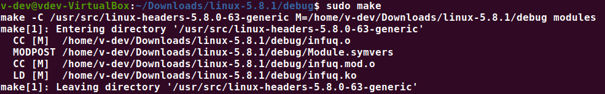
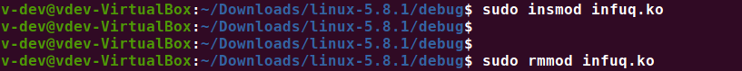
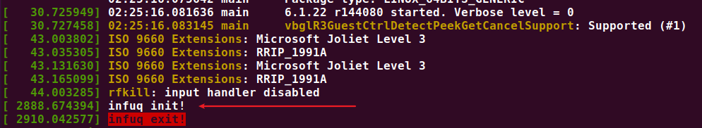

# 环境

Ubuntu 20.04

Linux源码版本linux-5.8.1


> 可以通过 cat /proc/version 或 uname -a 查看下本机的Linux版本, 然后再选择对应的版本下载.


```shell
v-dev@vdev-VirtualBox:~$ uname -r
5.8.0-63-generic

v-dev@vdev-VirtualBox:~$ ll /usr/src
total 24
drwxr-xr-x  6 root root 4096 8月   1 10:13 ./
drwxr-xr-x 14 root root 4096 4月  23  2020 ../
drwxr-xr-x 24 root root 4096 4月  23  2020 linux-headers-5.4.0-26/
drwxr-xr-x  7 root root 4096 4月  23  2020 linux-headers-5.4.0-26-generic/
drwxr-xr-x  7 root root 4096 8月   1 09:39 linux-headers-5.8.0-63-generic/
drwxr-xr-x 24 root root 4096 8月   1 09:39 linux-hwe-5.8-headers-5.8.0-63/
```


/etc/apt/sources.list

```xml
deb http://mirrors.aliyun.com/ubuntu/ focal main restricted universe multiverse
deb-src http://mirrors.aliyun.com/ubuntu/ focal main restricted universe multiverse
deb http://mirrors.aliyun.com/ubuntu/ focal-security main restricted universe multiverse
deb-src http://mirrors.aliyun.com/ubuntu/ focal-security main restricted universe multiverse
deb http://mirrors.aliyun.com/ubuntu/ focal-updates main restricted universe multiverse
deb-src http://mirrors.aliyun.com/ubuntu/ focal-updates main restricted universe multiverse
deb http://mirrors.aliyun.com/ubuntu/ focal-proposed main restricted universe multiverse
deb-src http://mirrors.aliyun.com/ubuntu/ focal-proposed main restricted universe multiverse
deb http://mirrors.aliyun.com/ubuntu/ focal-backports main restricted universe multiverse
deb-src http://mirrors.aliyun.com/ubuntu/ focal-backports main restricted universe multiverse

deb https://mirrors.tuna.tsinghua.edu.cn/ubuntu/ focal main restricted universe multiverse
deb https://mirrors.tuna.tsinghua.edu.cn/ubuntu/ focal-updates main restricted universe multiverse
deb https://mirrors.tuna.tsinghua.edu.cn/ubuntu/ focal-backports main restricted universe multiverse
deb https://mirrors.tuna.tsinghua.edu.cn/ubuntu/ focal-security main restricted universe multiverse

```


```shell

apt-get update
sudo apt-get install build-essential gcc make perl dkms
sudo apt-get install flex
sudo apt-get install bison
sudo apt-get install libncurses5-dev
sudo apt-get install libssl-dev
sudo apt-get install libelf-dev

reboot

```

# 编译内核源码


1.下载内核源码步骤


2.解压源码包

如果下载的文件类型是linux-5.8.1.tar.xz则需要两步解压

xz -d linux-5.8.1.tar.xz

tar -xvf linux-5.8.1.tar


如果下载的文件类型是linux-5.8.1.tar.gz则只需要一步解压

tar -xvf linux-5.8.1.tar.gz


3.指定硬件架构体系

```shell
# export ARCH=x86
```

4.配置board config


进入解压后的linux-5.8.1目录执行以下命令

```shell
# make x86_64_defconfig
```

结果如下图


5.配置内核

继续执行make menuconfig命令


6.编译内核


```shell
# sudo make
```


好长时间...


# 测试字符驱动

在linux-5.8.1目录下创建debug目录,并创建my_char.c和Makefile两个文件

字符设备驱动源文件 my_char.c

```c
#include <linux/init.h>
#include <linux/module.h>
#include <linux/fs.h>
#include <linux/device.h>
#include <linux/uaccess.h>


MODULE_LICENSE("GPL");

static struct class *my_char_class;
static int my_major;

static int my_open(struct inode *pinode, struct file *pfile)
{
        printk(KERN_WARNING "L%d->%s()   major=%d,minor=%d\n", __LINE__, __FUNCTION__, imajor(pinode), iminor(pinode));
    	return 0;
}
static ssize_t my_read(struct file *pfile, char __user *pbuf, size_t count, loff_t *off)
{
    int ret;
    char data[] = "this is kernel";
    int len = min(count, sizeof(data));
    ret = copy_to_user(pbuf,data,len);
        printk(KERN_WARNING "L%d->%s()\n", __LINE__, __FUNCTION__);
	return ret;
}
static ssize_t my_write(struct file *pfile, const char *pbuf, size_t count, loff_t *off)
{
    int ret;
    char data[100];
    int len = min(count, sizeof(data));
    ret = copy_from_user(data,pbuf,len);
    printk(KERN_WARNING "L%d->%s():%s\n", __LINE__, __FUNCTION__, data);
    	return count;
}
static int my_release(struct inode *pinode, struct file *pfile)
{
        printk(KERN_WARNING "L%d->%s()\n", __LINE__, __FUNCTION__);
	return 0;
}


static struct file_operations fops = {
    .owner = THIS_MODULE,
    .open = my_open,
    .read = my_read,
    .write = my_write,
    .release = my_release,
};


static int my_char_init(void)
{
    printk(KERN_INFO "my_char init!\n");
    // 查看cat /proc/devices   查看未使用的设备号
    // my_char 设备文件名称
    my_major = register_chrdev(0, "my_char", &fops);
    my_char_class = class_create(THIS_MODULE, "my_char_class");
    // 自动创建设备文件           也可以通过 `mknod /dev/my_char c 200 2` 手动创建设备文件
    device_create(my_char_class, NULL, MKDEV(my_major, 2), NULL, "my_char");
    
    return 0;
}
static void my_char_exit(void)
{
    printk(KERN_ALERT "my_char exit!\n");
    device_destroy(my_char_class, MKDEV(my_major, 2));
    class_destroy(my_char_class);
    unregister_chrdev(my_major, "my_char");
    
}

module_init(my_char_init);
module_exit(my_char_exit);


```


Makefile

```makefile
obj-m := my_char.o
KERNEL_DIR := /usr/src/linux-headers-$(shell uname -r)
PWD := $(shell pwd)
default:
	make -C ${KERNEL_DIR} M=${PWD} modules
clean:
    rm -f *.o *.ko *.mod.c *.mod.o modules.* Module.*

```


编译模块

```she
# sudo make
```





插入和卸载模块



通过执行dmesg命令查看输出信息




在/sys/class目录下会出现一个my_char_class目录.

在/dev/目录下会出现一个my_char字符设备文件.


测试一下字符设备驱动程序

main.c

```c
#include <stdio.h>
#include <sys/types.h>
#include <sys/stat.h>
#include <fcntl.h>
#include <unistd.h>


int main()
{
    
    	int fd;
    	char data[100];
    	fd = open("/dev/my_char", O_RDWR);
    	read(fd, data, 100);
    	printf("%s\n", data);

		char info[100] = "www.infuq.com";
		write(fd, info, 14);

		return 0;
}
```


# 测试块驱动


my_disk.c

```c

#include <linux/module.h>
#include <linux/fs.h>
#include <linux/device.h>
#include <linux/sched.h>
#include <linux/mount.h>
#include <asm/io.h>
#include <linux/uaccess.h>
#include <mach/devices.h>
#include <mach/soc.h>
#include <mach/platform.h>
#include <linux/miscdevice.h>
#include <linux/delay.h>
#include <linux/genhd.h>
#include <linux/blkdev.h>
#include <linux/hdreg.h>
#include <linux/vmalloc.h>

MODULE_LICENSE("GPL");

#define VDISK_SIZE 10 * 1024 * 1024 // 10M
#define SECTOR_SIZE 512

static int my_disk_major;
static struct gendisk *gdisk;
static spinlock_t lock;
unsigned char *vmem; // 基于内存的磁盘,即把内存中的某块区域当成磁盘使用.

static int my_disk_open(struct block_device *dev, fmode_t mod)
{
    return 0;
}
static int my_disk_getgeo(struct block_device *blk, struct hd_geometry *geo)
{
    geo->heads = 4;
    geo->sectors = 16;
    geo->start = 0;
    geo->cylinders = 10 * 1024 * 1024 / 512 /4 /16;
    return 0;
}

static struct block_device_operations my_disk_fops = {
    .owner = THIS_MODULE,
    .open = my_disk_open,
    .getgeo = my_disk_getgeo,
}

static void handle_disk_request(struct request_queue *queue)
{
    struct request *req;
    unsigned int size,off;
    req = blk_fetch_request(queue);
    while (req)
    {
        size = blk_rq_cur_bytes(req);
        off = req->__sector * SECTOR_SIZE;

        if (rq_data_dir(req) == READ)
            memcpy(req->buffer, vmem + off, size);
        else if (rq_data_dir(req) == WRITE)
            memcpy(vmem + off, req->buffer, size);

        if (!__blk_end_request_cur(req, 0))
            req = blk_fetch_request(queue);
    }
}


static int __init my_disk_init(void)
{

    vmem = vmalloc(VDISK_SIZE);
    my_disk_major = register_blkdev(0, "my_disk");
    gdisk = alloc_disk(3);

    gdisk->major = my_disk_major;
    gdisk->first_minor = 1;
    gdisk->fops = &my_disk_fops;
    strcpy(gdisk->disk_name, "my_ram_disk");
    spin_lock_init(&lock);
    gdisk->queue = blk_init_queue(handle_disk_request, &lock);

    set_capacity(gdisk, VDISK_SIZE / SECTOR_SIZE);

    add_disk(gdisk);

    return 0;
}

static void __exit my_disk_exit(void)
{
    del_gendisk(gdisk);
    put_disk(gdisk);
    unregister_blkdev(my_disk_major, "my_disk");
    vfree(vmem);
}


module_init(my_disk_init);
module_exit(my_disk_exit);
```


# 编译busybox


1.下载解压


https://busybox.net/downloads/busybox-1.30.0.tar.bz2

解压命令tar -xvf busybox-1.30.0.tar.bz2

解压到与linux-5.8.1目录同级


2.配置


3.编译和安装


完成之后会生成一个_install目录,进入此目录


```shell

[x-dev@DESKTOP-EODNRN1 _install]$ mkdir etc dev mnt
[x-dev@DESKTOP-EODNRN1 _install]$ mkdir -p proc sys tmp mnt
[x-dev@DESKTOP-EODNRN1 _install]$ mkdir -p etc/init.d/
[x-dev@DESKTOP-EODNRN1 _install]$ vim etc/fstab
proc        /proc           proc         defaults        0        0
tmpfs       /tmp            tmpfs    　　defaults        0        0
sysfs       /sys            sysfs        defaults        0        0
[x-dev@DESKTOP-EODNRN1 _install]$ vim etc/init.d/rcS
echo -e "Welcome to tinyLinux"
/bin/mount -a
echo -e "Remounting the root filesystem"
mount  -o  remount,rw  /
mkdir -p /dev/pts
mount -t devpts devpts /dev/pts
echo /sbin/mdev > /proc/sys/kernel/hotplug
mdev -s
[x-dev@DESKTOP-EODNRN1 _install]$ chmod 755 etc/init.d/rcS
[x-dev@DESKTOP-EODNRN1 _install]$ vim etc/inittab
::sysinit:/etc/init.d/rcS
::respawn:-/bin/sh
::askfirst:-/bin/sh
::cttlaltdel:/bin/umount -a -r
[x-dev@DESKTOP-EODNRN1 _install]$ chmod 755 etc/inittab
[x-dev@DESKTOP-EODNRN1 _install]$ cd dev
[x-dev@DESKTOP-EODNRN1 dev]$ sudo mknod console c 5 1
[x-dev@DESKTOP-EODNRN1 dev]$ sudo mknod null c 3 1
[x-dev@DESKTOP-EODNRN1 dev]$ sudo mknod tty1 c 4 1

```


# 制作最小的根文件系统


在busybox-1.30.0目录下执行以下命令


```shell

rm -rf rootfs.ext3
rm -rf fs
# 制作一个空镜像
dd if=/dev/zero of=./rootfs.ext3 bs=1M count=32
# 将镜像文件格式化成ext3格式
mkfs.ext3 rootfs.ext3
# 创建一个挂载点目录
mkdir fs
# 将空镜像挂载到挂载点
mount -o loop rootfs.ext3 ./fs
# 将根文件系统目录和文件复制到挂载点
cp -rf ./_install/* ./fs
umount ./fs
# 将镜像打包成内核可以识别的格式
gzip --best -c rootfs.ext3 > rootfs.img.gz

```


# 启动


apt install qemu-system-x86


```shell

$ qemu-system-x86_64 \
  # 内核镜像地址
  -kernel ./linux-4.9.229/arch/x86_64/boot/bzImage  \
  # 根文件系统镜像地址
  -initrd ./busybox-1.30.0/rootfs.img.gz   \
  -append "root=/dev/ram init=/linuxrc"  \
  -serial file:output.txt
  
  
```


参考链接

https://www.bilibili.com/read/cv11271232


