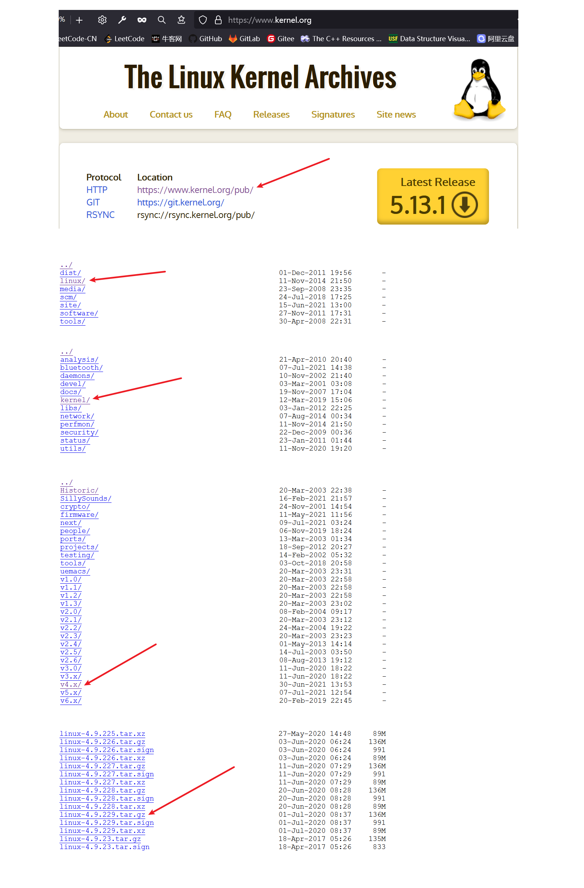
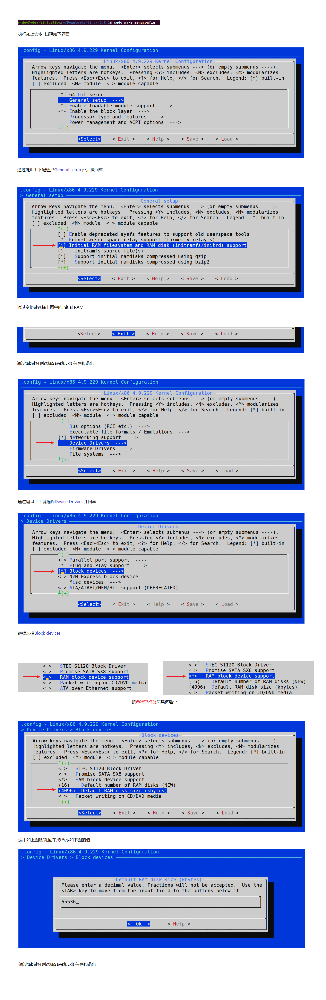
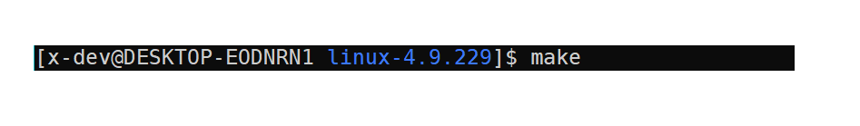
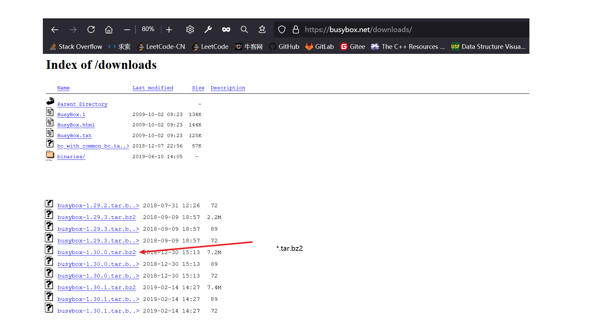
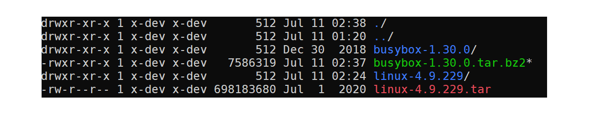
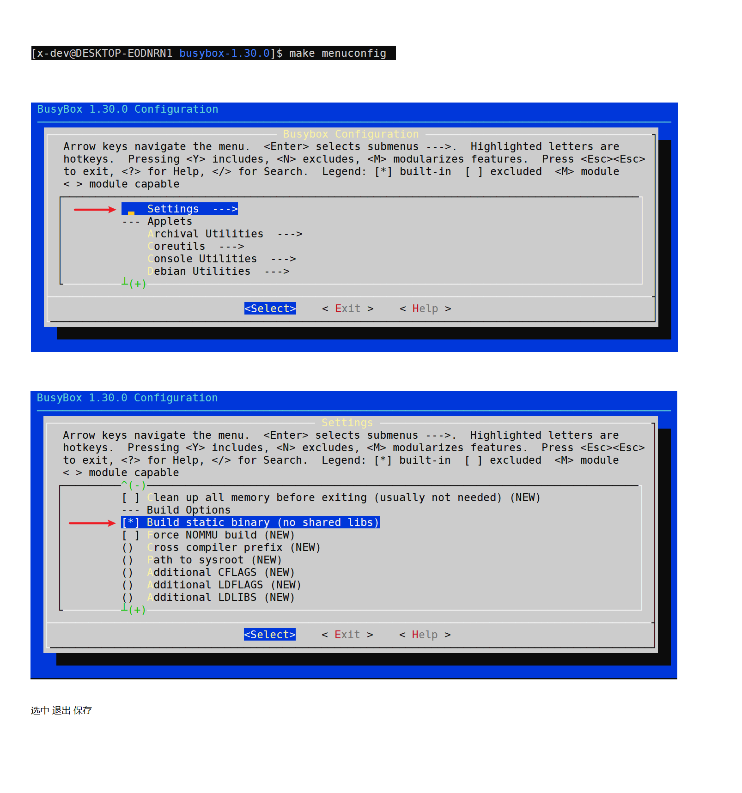
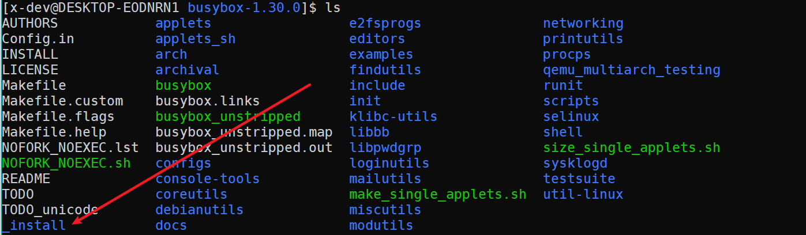

# 环境

Ubuntu 18.04

Linux源码版本linux-4.9.229


# 编译内核源码


1.下载内核源码步骤




2.解压源码包

如果下载的文件类型是linux-4.9.229.tar.xz则需要两步解压

xz -d linux-4.9.229.tar.xz

tar -xvf linux-4.9.229.tar


如果下载的文件类型是linux-4.9.229.tar.gz则只需要一步解压

tar -xzvf linux-4.9.229.tar.gz


3.指定硬件架构体系

```shell
# export ARCH=x86
```

4.配置board config


```shell


apt-get update
sudo apt-get install build-essential gcc make perl dkms
sudo apt-get install flex
sudo apt-get install bison
sudo apt-get install libncurses5-dev
reboot

```


进入解压后的linux-4.9.229目录执行以下命令

```shell
# make x86_64_defconfig
```

结果如下图


5.配置内核

继续执行make menuconfig命令




6.编译内核




好长时间...


# 编译busybox


1.下载解压



https://busybox.net/downloads/busybox-1.30.0.tar.bz2

解压命令tar -xvf busybox-1.30.0.tar.bz2

解压到与linux-4.9.229目录同级




2.配置




3.编译和安装


完成之后会生成一个_install目录,进入此目录




```shell

[x-dev@DESKTOP-EODNRN1 _install]$ mkdir etc dev mnt
[x-dev@DESKTOP-EODNRN1 _install]$ mkdir -p proc sys tmp mnt
[x-dev@DESKTOP-EODNRN1 _install]$ mkdir -p etc/init.d/
[x-dev@DESKTOP-EODNRN1 _install]$ vim etc/fstab
proc        /proc           proc         defaults        0        0
tmpfs       /tmp            tmpfs    　　defaults        0        0
sysfs       /sys            sysfs        defaults        0        0
[x-dev@DESKTOP-EODNRN1 _install]$ vim etc/init.d/rcS
echo -e "Welcome to tinyLinux"
/bin/mount -a
echo -e "Remounting the root filesystem"
mount  -o  remount,rw  /
mkdir -p /dev/pts
mount -t devpts devpts /dev/pts
echo /sbin/mdev > /proc/sys/kernel/hotplug
mdev -s
[x-dev@DESKTOP-EODNRN1 _install]$ chmod 755 etc/init.d/rcS
[x-dev@DESKTOP-EODNRN1 _install]$ vim etc/inittab
::sysinit:/etc/init.d/rcS
::respawn:-/bin/sh
::askfirst:-/bin/sh
::cttlaltdel:/bin/umount -a -r
[x-dev@DESKTOP-EODNRN1 _install]$ chmod 755 etc/inittab
[x-dev@DESKTOP-EODNRN1 _install]$ cd dev
[x-dev@DESKTOP-EODNRN1 dev]$ sudo mknod console c 5 1
[x-dev@DESKTOP-EODNRN1 dev]$ sudo mknod null c 3 1
[x-dev@DESKTOP-EODNRN1 dev]$ sudo mknod tty1 c 4 1

```


# 制作最小的根文件系统


在busybox-1.30.0目录下执行以下命令


```shell

rm -rf rootfs.ext3
rm -rf fs
dd if=/dev/zero of=./rootfs.ext3 bs=1M count=32
mkfs.ext3 rootfs.ext3
mkdir fs
mount -o loop rootfs.ext3 ./fs
cp -rf ./_install/* ./fs
umount ./fs
gzip --best -c rootfs.ext3 > rootfs.img.gz

```


# 启动


apt install qemu-system-x86


```shell

# qemu-system-x86_64 \
  -kernel ./linux-4.9.229/arch/x86_64/boot/bzImage  \
  -initrd ./busybox-1.30.0/rootfs.img.gz   \
  -append "root=/dev/ram init=/linuxrc"  \
  -serial file:output.txt
```


参考链接

https://www.bilibili.com/read/cv11271232


