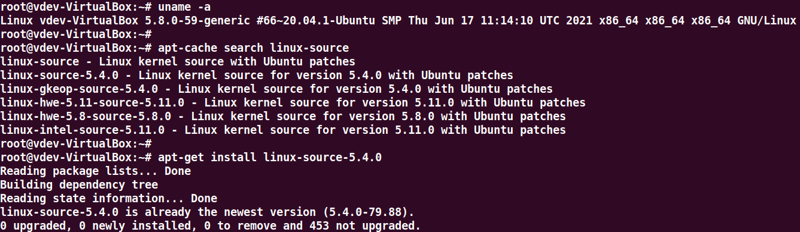
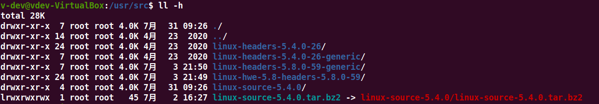
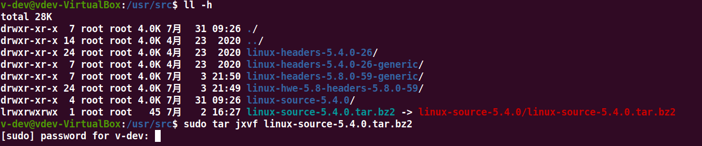

1.下载内核源码


> cat /proc/version 或 uname -a





```shell
uname -a

apt-cache search linux-source

apt-get install linux-source-5.4.0
```


查看下载后的源码包




2.解压



```shell
sudo tar jxvf linux-source-5.4.0.tar.bz2
```


3.编译

具体的编译可以参考'编译内核(v4.9).md'


